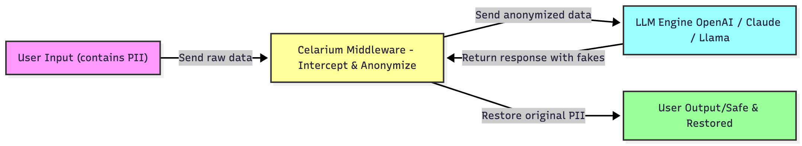

# Celarium 🛡️
### Context-Aware Privacy Middleware for AI Agents & LLMs

[](https://opensource.org/licenses/Apache-2.0)
[](https://www.python.org/)
[]()
[](http://98.81.182.73/docs)

**Celarium acts as a smart firewall between your users and Large Language Models (LLMs).** 

It intercepts sensitive data, replaces it with context-aware, consistent synthetic entities, and **restores the original values** after the LLM responds—even if the LLM hallucinates or changes formats.

---

##  Try it Live
You can test the API immediately via the interactive Swagger UI running on our AWS Demo instance. No installation required.

👉 **[Launch Live Demo & Docs](http://98.81.182.73/docs)**

*(Note: This is a demonstration instance. Please do not send real, sensitive PII to this public endpoint.)*

---

## The Problem
When you redact PII using standard tools (like Microsoft Presidio), LLMs lose context and generate robotic responses.

| Method | Input | LLM "Mental Model" | Result |
| :--- | :--- | :--- | :--- |
| **Raw Data** | "John Doe (MRN-123) has flu." | "Specific Patient John" | ❌ **Privacy Leak** |
| **Redaction** | "\<PERSON\> (\<ID\>) has flu." | "Generic Placeholder" | ⚠️ **Robotic / Low Quality** |
| **Celarium** | "Michael Smith (MRN-999) has flu." | "Specific Patient Michael" | ✅ **High Quality & Private** |

---

## Features

- **Context-Aware Anonymization**: Uses **GLiNER** (Generalist Lightweight NER) to detect entities based on semantic context, not just regex patterns.
- **Semantic Consistency**: If "John Doe" is replaced with "Robert Smith", "john@gmail.com" automatically becomes "robert.smith@example.com". The LLM never notices the switch.
- **Robust Restoration Engine**: Includes a fuzzy-matching logic that handles LLM hallucinations. If the LLM outputs "Rob Smith" instead of "Robert Smith", or changes `(555) 123-4567` to `+1-555...`, Celarium still correctly restores it to the original data.
- **Batch Processing**: Natively handles JSON Lists and complex dictionaries without breaking structure.
- **Stateless & Secure**: Mappings are stored in-memory. No PII is logged to disk.

---

## 🛠 How It Works




**Workflow:**

1. **Intercept:** You send raw data to Celarium.  
2. **Anonymize:** Celarium uses a Hybrid Engine (AI + Strict Regex) to generate realistic fakes.  
3. **Process:** You send the clean text to your LLM. The LLM "thinks" it is talking to a real person.  
4. **Restore:** You send the LLM's response back to Celarium. We swap the fakes back to the originals.  

---

## Integration (The "Sandwich" Pattern)
Implementing Celarium is a simple 3-step wrapper around your LLM call. Example using **LangChain**:

```python
import requests
from langchain_openai import ChatOpenAI

# 1. Setup
celarium_url = "http://98.81.182.73" # Or http://localhost:8000
llm = ChatOpenAI(model="gpt-4", api_key="...")

def safe_chat(user_input):
    # --- STEP 1: ANONYMIZE ---
    anon_resp = requests.post(
        f"{celarium_url}/v1/anonymize", 
        json={"text": user_input},
        headers={"X-API-Key": "sk_test_celarium_founder_001"}
    ).json()
    
    clean_text = anon_resp["anonymized_text"]
    session_id = anon_resp["session_id"]

    # --- STEP 2: LLM PROCESSING ---
    llm_response = llm.invoke(clean_text).content

    # --- STEP 3: RESTORE ---
    final_resp = requests.post(
        f"{celarium_url}/v1/restore",
        json={"session_id": session_id, "text": llm_response},
        headers={"X-API-Key": "sk_test_celarium_founder_001"}
    ).json()

    return final_resp["restored_text"]
```

[View Example Chatbot](examples/healthcare_cs_example.py)

---

## 🚀 Quick Start (CURL)

**Step 1: Anonymize Data**
```bash
curl -X POST "http://98.81.182.73/v1/anonymize"   -H "X-API-Key: sk_test_celarium_founder_001"   -H "Content-Type: application/json"   -d '{
    "text": "Patient John Doe (DOB 1985-07-14) admitted to Springfield General. MRN-998877."
  }'
```

**Step 2: Restore Data**
```bash
curl -X POST "http://98.81.182.73/v1/restore"   -H "X-API-Key: sk_test_celarium_founder_001"   -H "Content-Type: application/json"   -d '{
    "session_id": "YOUR_SESSION_ID",
    "text": "Summary: Michael Smith was treated at Oak Ridge..."
  }'
```

---

##  Use Cases

### 🏥 Healthcare (HIPAA)
- Summarize patient notes or draft insurance appeals safely using LLMs.
- Detects: Patient Names, MRNs, SSNs, Doctor Names, Dates, Hospital Names.
- Safety: Address blocks are replaced entirely to prevent location leakage.

### ⚖️ Legal & Finance
- Process contracts or bank statements without exposing client identities.
- Detects: Organization Names, Policy Numbers, Group IDs, Dollar Amounts (optional).
- Benefit: Maintain contract analysis while masking sensitive parties.

### 👤 HR & Recruitment
- Analyze employee feedback or resumes while reducing bias.
- Detects: Names, Emails, Phone Numbers.
- Benefit: LLM judges the content, not demographics.

---

## 💻 Local Installation
```bash
# Clone the repo
git clone https://github.com/jesbnc100/celarium.git
cd celarium

# Install requirements
pip install -r requirements.txt

# Run the server
python main.py
```
Server starts at `http://localhost:8000`

---

##  Security & Architecture

- **Ephemeral Storage:** Mappings stored in memory (Fail-secure).  
- **Zero Persistence:** No input text is written to databases or logs.  
- **Hybrid Detection:** Regex engine catches patterns like SSN, Email, Phone if AI model misses them.  

---

##  Roadmap

- Redis integration for distributed session storage.
- Custom fine-tuned NER models for Legal/Finance.
- "Confidence Score" to flag potential missed PII.
- PDF / Docx / CSV support.

---

## 📜 License
Apache 2.0 License - see LICENSE file.

---

## 📬 Contact
For enterprise inquiries or custom deployments, please open a GitHub issue.
