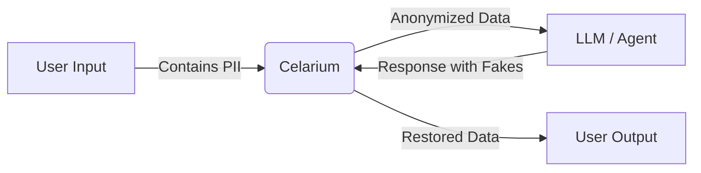

# Celarium

**Context-Aware Privacy Middleware for AI Agents & LLMs**

Celarium acts as a smart firewall between your users and Large Language Models. It intercepts sensitive data, replaces it with context-aware, consistent fake entities, and restores the original values after the LLM responds.

---

## Why Celarium?

Unlike simple regex tools that redact data ([REDACTED]), Celarium maintains semantic consistency.

- **Context-Aware AI**: Uses GLiNER (Generalist Lightweight NER) to detect entities based on context, not just patterns.
- **Handles**: MRN, SSN, Insurance Policy, Group IDs, Hospital Names (regex + AI detection)
- **Data Consistency**: If "John Doe" becomes "Robert Smith", his email becomes robert.smith@example.com automatically.
- **Batch Processing**: Natively handles JSON Lists and complex objects without hitting token limits.
- **Smart Restoration**: The LLM "thinks" it's talking to Robert Smith. When the response comes back, Celarium swaps it back to John Doe.

---

## 🛠 How It Works



1. **Intercept**: Send raw data (Text or JSON) to Celarium.
2. **Anonymize**: Celarium uses a Hybrid Engine (GLiNER AI + Strict Regex) to generate realistic fakes.
3. **Process**: Send the clean data to OpenAI/Claude/Gemini.
4. **Restore**: Send the LLM's response back to Celarium to swap the names back.

---

## Quick Start

### Option A: Hosted API
The easiest way to use Celarium is via the hosted API. No installation required.
Base URL:
1. Anonymize Data
Send text or a list of JSON objects. The system auto-detects PII (Names, Emails, Phones, Medical IDs).
code

curl -X POST  \
  -H "X-API-Key: sk_test_celarium_founder_001" \
  -H "Content-Type: application/json" \
  -d '{
    "text": "Patient John Doe (DOB 1985-07-14) admitted to Springfield General. MRN-998877."
  }'
Response:
code
JSON
{
  "anonymized_text": "Patient Michael Smith (DOB 1962-03-12) admitted to Oak Ridge Medical Center. MRN-112233.",
  "session_id": "abc123uuid...",
  "entities_found": 4
}
2. Process with LLM
Send the anonymized_text to OpenAI, Claude, or your local model. The LLM sees "Michael Smith" and processes it safely.
3. Restore Data
Send the LLM's response back to Celarium to swap the names back.
code

curl -X POST  \
  -H "X-API-Key: sk_test_celarium_founder_001" \
  -H "Content-Type: application/json" \
  -d '{
    "session_id": "abc123uuid...",
    "text": "Summary: Michael Smith was treated at Oak Ridge..."
  }'
### Option B: Local Python
Requires Python 3.10+

```bash
pip install -r requirements.txt
python main.py
```

The API runs on [http://localhost:8000](http://localhost:8000)

---

## Usage Examples

### 1. Medical / Clinical Data (Unstructured)

Celarium detects specialized medical fields and formatting.

```bash
curl -X POST http://localhost:8000/v1/anonymize \
  -H "X-API-Key: sk_test_celarium_founder_001" \
  -H "Content-Type: application/json" \
  -d '{
    "text": "Patient John Doe, DOB 1985-07-14, SSN 123-45-6789, MRN MRN-998877, admitted to Springfield General Hospital with Dr. House."
  }'
```

**Response Example:**

```json
{
  "anonymized_text": "Patient Michael Stevens, DOB 1962-03-12, SSN 542-11-9021, MRN MRN-112233, admitted to Oak Ridge Medical Center with Dr. Wilson.",
  "session_id": "abc123uuid",
  "entities_found": 6
}
```

---

### 2. Batch Processing (JSON Lists)

Send entire database records. Celarium automatically handles list iteration and context preservation.

```bash
curl -X POST http://localhost:8000/v1/anonymize \
  -H "X-API-Key: sk_test_celarium_founder_001" \
  -H "Content-Type: application/json" \
  -d '{
    "text": [
      { "name": "Carlos Rivera", "email": "carlos@outlook.com", "policy": "POL-12345" },
      { "name": "Sarah Jones", "email": "sarah.j@gmail.com", "policy": "POL-98765" }
    ]
  }'
```

**Response Example:**

```json
{
  "anonymized_text": "[\n  { \"name\": \"David Kim\", \"email\": \"davidkim99@example.com\", \"policy\": \"POL-554433\" },\n  { \"name\": \"Emily White\", \"email\": \"emilywhite22@example.com\", \"policy\": \"POL-112211\" }\n]",
  "session_id": "xyz789uuid",
  "entities_found": 6
}
```

---

### 3. Restore Data

After your LLM generates a response using the fake names, swap them back.

```bash
curl -X POST http://localhost:8000/v1/restore \
  -H "X-API-Key: sk_test_celarium_founder_001" \
  -H "Content-Type: application/json" \
  -d '{
    "session_id": "abc123uuid",
    "text": "We have updated the records for Michael Stevens regarding MRN-112233."
  }'
```

**Response Example:**

```json
{
  "restored_text": "We have updated the records for John Doe regarding MRN-998877."
}
```

---

## 🚀 Deployment

- Designed for Railway, Heroku, or AWS.
- Push to GitHub.
- Connect to Railway/Heroku.
- Deploy.

The included Dockerfile handles the AI model download during the build phase. The server automatically optimizes for CPU usage.

---

## 🛡 Security & Compliance

- **Ephemeral Storage**: Mappings are stored in-memory. If the server restarts, the data is gone.
- **PII Never Logs**: We do not log the input text or the mappings to disk.
- **Strict Regex Fallback**: If the AI misses a pattern, our strict Regex engine catches SSNs, Phones, and Emails as a failsafe.
- **Address Protection**: Entire address blocks (Street + City + State) are replaced to prevent location leakage.

---

## Status

This is a **proof-of-concept**. We're actively looking for:

- Early adopters to validate the approach
- Feedback on detection accuracy
- Use cases beyond healthcare